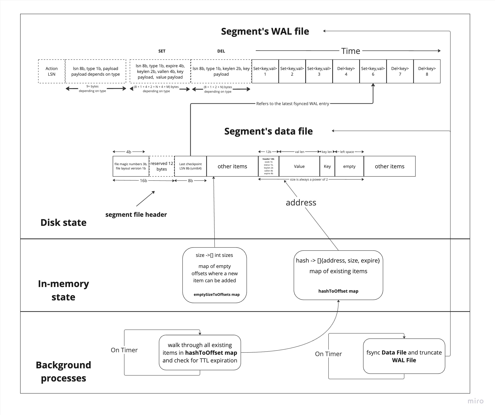

# Internals

## Terminology table

| Word  | Meaning |
| ------------- | ------------- |
| Zapp | A high-performance key-value database, which stores data on disk |
| Item | A database key-value entry with optional TTL value |
| Segment | Zapp's internal storage of items. All items are partitions over the segments. |
| MurMur3 | A popular hash function algorithm with zero allocations used to calculate a hash value for a key |
| Data File | A file used by a segment to store its items |
| Write Ahead Log File | An append only file, which is optionally used by Zapp to remember each modify operation. It is used when something goes wrong, and Zapp has to restore itself |
| WAL entry | WAL File consists of WAL entries. Each entry is one of the modifying commands and its parameters |
| Log Sequence Number | LSN is a sequencial integer number assigned to each WAL entry |
| In-memory state | Zapp's state stored in RAM for boosting performance. This state is not extremely important and can be lost when failures happen. It will be restored by Zapp after restart from Data File and WAL File |
| Background process | Some code executed by Zapp asynchronously to modify its state. All Zapp's background processes are optional, but very useful |

## Database high-level design

Zapp is a key-value database designed to be scalable. Scalability can be achieved by vertical scaling number of CPUs and number of SSD drives. Currently Zapp provides only 3 types of opperations: Set, Get and Delete.

Zapp is designed for low RAM usage. Keys and Values are not stored in memory explicitly. Instead, Zapp provides a mechanism to store data on the disk and effecively retrieve it from the disk.

The data is partitioned over a variable number partitions. Each partition is called a "segment". Each key belongs to one single segment. The keys are spread over segments randomly by using the MurMur3 hash function.

Each segment has one file containing keys, values, TTL and some metadata. This file is called Data File.

The idea to introduce the segments concept is that:
1. Data written to a segment is stored in the Operational System's file system buffers and synced to the disk in the background. Two separate segments have different sync time and therefore requests don't get blocked at once.
2. Segments' Data Files can belong to different SSD drives. This is how Zapp achieves scalability.

## Segment's high-level Architecture 

## Data File alignment

Each segment's Data File consists of a header and a body. The Header contains:
- File's magic numbers
- File's alignment version (for future alignment changes)
- (Only if WAL enabled) Last applied LSN (Log Sequence Number), which refers to some entry on the WAL file.

The rest of the file contains segment's items. An Item is a single Key-Value-Expiration Time-Metadata entry in the file. Each item's size is padded to the neares power of 2. This is a tricky technique, that allows reusing item's offsets, after the key has been expired or deleted.
Zapp tries to reuse item's offsets, so that it doesn't have to allocate new item on disk every time. Happily, items often have the same power-of-2 sizes and Zapp can reuse old item's offsets to store some new data.

## Write Ahead Log (WAL)

Zapp implements an optional feature that enables Write Ahead Logging technique. WAL file is an append-only file. Each write operation is first appended to the WAL File and only then written to the Data File

Enabling Write Ahead Logging provides durability guarantees. In case of a sudden failure some data from the Data File might not be synced to disk. After restarting and recovering from the existing file Zapp may not find the latest items. With the help of WAL file Zapp will manage to restore each segment's Data File by reapplying actions in the exact same order.

# In-memory state

Each segment contains some sort of in-memory indexes. First is a hash-to-offset map. Zapp uses it to manage the existing items. The other is size-to-offset map of not used old items' slots. Zapp uses that to find an existing offset to write new data to.

### Hash-to-Offset Map 

Hash-to-Offset Map contains mapping for all existing items to their corresponding offsets in Data File. Zapp doesn't store keys in memory to save more RAM. Instead, it stores only fixed size hash value for the item's key. 
Of cource, storing only hashes leads to hash collisions. And Zapp is ready to resolve hash collisions. That's why each hash is mapped to a list of possible items, where each item has the same hash value. Zapp linearly checks each item and finds the needed one.

### Size-To-Offset Map

Size-To-Offset Map contains a mapping of powers of 2 to the existing file's offsets where there's not valid item any more. When item is expired or deleted, it's offset is added to list of offsets corresponding to the item's power-of-2 size. Zapp always tries to reuse existing offsets in priority, so that the file's size is kept as small as possible.

## Background processes

Currenlty Zapp provides options to enable two optional background processes: sync file process and collect expired items process.

### Sync file process

Sync file process is an optional background process, that syncs the Data File to the disk and truncates the WAL file. The idea is that, once we want to have guarantees of durability, we have to make sure, that data file is synced to a disk periodically. Syncing files to the disk is a very expensive operation and Operation Systems try to do it in the background if possible. After Data File is synced to the disk, WAL file can be truncated without fear, because all applied operations are already saved.

### Collect expired items process

Collect expired items process is an optional background process, that modifies only in-memory state, finds all expired items and moves them to the Size-To-Offset Map. It is very recommended to enable Collect Expired Items Process if you use TTL feature often. Zapp will not return expired items when reading it from disk. But Zapp will not mark expired items as deleted and remove them from Hash-To-Offset Map itself.
